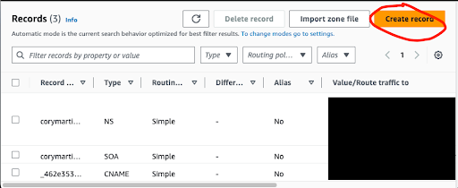

A wiki is a great way to keep track of organizational info. But maybe you want to track some personal notes and you don’t want to pay for a Confluence license. This blog post will show you how you can host a wiki with a custom domain, using AWS’s world-wide network to deliver your content at lightning speed for about $1.00 per month.

I will be using AWS’s CDK and an open source tool called Dendron. There will be a little bit of hand-waving with the help of a repo that I have provided. But I’ll try to explain what the code in that repo is doing at the end, if you’d like to dive deeper.

## Prerequisites / Assumptions

- You have an AWS account. [Instructions](https://docs.aws.amazon.com/accounts/latest/reference/manage-acct-creating.html)
- There will be some charges affiliated with this process, so your AWS account will need to have a payment method attached. [Instructions](https://docs.aws.amazon.com/awsaccountbilling/latest/aboutv2/manage-cc.html#:~:text=To%20add%20a%20credit%20card%20to%20your%20AWS%20account,Enter%20the%20credit%20card%20information.)
- You have a github account. [Instructions](https://docs.github.com/en/get-started/start-your-journey/creating-an-account-on-github)
- You are comfortable using the terminal on your local machine.
- The following are installed on your machine:
  - node [Instructions](https://nodejs.org/en/download/package-manager)
  - npm [Instructions](https://docs.npmjs.com/downloading-and-installing-node-js-and-npm)
  - aws-cli [Instructions](https://docs.aws.amazon.com/cli/latest/userguide/getting-started-install.html)
  - cdk [Instructions](https://docs.aws.amazon.com/cdk/v2/guide/getting_started.html)

## Get a domain

Once you’re logged in to your AWS account, visit [Route 53's domain search](https://us-east-1.console.aws.amazon.com/route53/domains/home#/DomainSearch) to select your domain. I chose https://corymartin.click because the `click` TLD was the cheapest available through AWS. Three dollars per year! If you’d like to see other TLD prices, [here is a spreadsheet I created with those prices](https://docs.google.com/spreadsheets/d/1oVYl6f69f8w_J3JUSFsi6oZV5vHn9CzsIJSX9KE5qnY/edit).

Once you’ve selected your domain, enter your contact information and follow the directions for registration. Be sure the “Turn on privacy protection” checkbox is checked.

## Get a certificate

1. Visit AWS Certificate Manager [link](https://us-east-1.console.aws.amazon.com/acm/home?region=us-east-1#/certificates/list)
1. Click “Request”
1. Leave “Request a public certificate" selected and click “Next”
1. Enter the domain you chose. I entered `corymartin.click`
1. Leave all other default values and click “Request”
1. On the subsequent page, find the ARN and copy it into a text editor. You will need it later.
1. On that same page, you should also see a section labeled “Domains” with a button that says “Create records in Route 53”. Click that button. Then confirm that selection by clicking “Create Records” on the next page.

That’s all you have to do for this step. If you’d like, you can navigate back to Route 53 to see the records you just created.
It may take a little time for the certificate to be granted. But you can continue with the next steps while waiting for the certificate.

## Fork my repo

My repo can be found at https://github.com/murribu/wiki. [Forking instructions](https://docs.github.com/en/pull-requests/collaborating-with-pull-requests/working-with-forks/fork-a-repo).

Then clone the repo to your local machine.

There will be a section at the end where I discuss what all is going on in this repo. But if you don’t care about that, you can just ignore that part at the end.

## Create a connection to github

The following is a boiled down version of [this documentation](https://docs.aws.amazon.com/dtconsole/latest/userguide/connections-create-github.html).

1. Create a connection in Codesuite to connect to your github account. [Click here](https://us-east-1.console.aws.amazon.com/codesuite/settings/connections/create) to go to the creation page.
1. Select “GitHub”
1. Name it whatever you like. (I named mine `murribu-github`) Then click on Create.
1. Make sure you’re logged into your github account in the browser and click on “Install a new app”
1. The next screen you see will be a github screen. I recommend choosing the “Only select repositories” option and selecting the one repository that is being used for this project.
1. Click “Install”
1. Click “Connect”
1. Then click into the new connection and copy its ARN (you’ll use this in the next step).

## Configure with your info

Next, copy my `config.example.ts` file to a new `config.ts` file. Don’t worry, this will be git-ignored, so it won’t be committed to your repo.

1. `cp config.example.ts config.ts`
1. Replace my values with yours in the new `config.ts` file.

## Edit your dendron.yml file

Open up dendron.yml and replace the following entries with your appropriate data. You can use [this commit](https://github.com/murribu/wiki/commit/df96010729de2bfe0c8d20e17a8670b6ce5cd85e) as a guide to what might need to change in your repo.

1. siteUrl
1. seo
1. github -> editRepository

## Create a secret

Go to Secrets Manager, and click on “Store a new secret”. Choose “Other type of secret” and enter the following key/value pairs:

| Key             | Value                                                |
| --------------- | ---------------------------------------------------- |
| DOMAIN          | The domain you registered. Mine is corymartin.click  |
| CERT_ARN        | The ARN you copied from the “Get a certificate” step |
| DISTRIBUTION_ID | Leave blank initially. We’ll fill this in later      |

## Install dendron cli

```
npm i -g @dendronhq/dendron-cli@0.117.0
```

## Deploy

Open up your terminal and navigate to the root of the repo that you cloned.

First, you’ll need to export the dendron site

```
cd src
npx dendron publish export
cd ..
```

This will establish the needed src/.next/out directory.

If you’ve never used the cdk before, you’ll need to bootstrap your account

```
npx cdk bootstrap
```

Then you should be able to deploy the codebuild stack, like this.

```
npx cdk deploy WikiCodebuildStack --require-approval never
```

This will take a couple of minutes to complete. You will need to wait for it to complete before continuing. You can follow the deployment's progress in the [Cloudformation console](https://us-east-1.console.aws.amazon.com/cloudformation/home?region=us-east-1).

## Enter your Distribution ID

1. Visit the [Cloudfront console](https://us-east-1.console.aws.amazon.com/cloudfront/v4/home?region=us-east-1#/distributions).
1. Assuming the deployment successfully completed, you should see a new distribution. Copy its ID. (It should be a series of numbers and upper-case letters)
1. Go back to the Secret you created and use that ID that you just copied to fill in the Distribution ID that we left blank earlier

## Create A Record in Route 53

Visit your Route 53 Hosted Zones in the console. And click on your new domain.

Then click on Create Record



On the subsequent screen, there are 4 steps.

1. Toggle on the “Alias” button
1. Select “Alias to CloudFront distribution”
1. In the “Choose distribution” input box, select the distribution that you just created.
1. Click “Create records”


## You’re done!

You should be able to enter your domain into a browser and see the wiki!

## Updating your wiki

I recommend getting familiar with the [dendron docs](https://wiki.dendron.so/). But generally, you can create new notes in your `src/notes/` folder to add them to your wiki.

If everything is set up correctly, you should be able to commit any new changes to your repository and they will be deployed out your site through the CodeBuild CICD that is set up in the repo.

Here are some helpful tips:

1. Use the VS Code Command `Dendron: Create Note` to create a new note. It fills in the header info for you.
1. The dendron docs say not to change the `id` on a note, but I have found that if you set it to something non-random as soon as you create it, there is no problem. This is important because the note’s id is used to determine its url. If you’d like a url that is a bit prettier, you can replace the note’s randomly assigned id with something more sensical.
1. The outline structure on the resultant site is determined by dendron’s internal hierarchy system, which is based on the . delimiter in each note file. See this doc for more details: https://wiki.dendron.so/notes/f3a41725-c5e5-4851-a6ed-5f541054d409/
1. If you’d like to see a more fully fledged version of this wiki idea, you can visit https://cory.school
1. To see your wiki in a local dev environment, navigate to the src directory under the root of your project and run `npx dendron publish dev`. This will host your site at http://localhost:3000

## Things I’d like to change

### Create A Record via CDK

I attempted to put the creation of an A record in the cdk code, but I couldn’t get it to synth locally. I would love to spend more time trying to figure out a way to incorporate this step into the IaC, but I decided to leave that undone for now.

### Least privileges

In the codebuild stack, I gave the project’s role some privileges that I probably could have narrowed down. Generally, it is best practice to give a role the least privileges it needs to do its job. Specifically, I could have determined which s3, cloudfront, and cloudformation actions it needs and narrowed its scope. But this was a compromise between giving the role blanket admin permissions and finishing the project in a timely manner.

## Explaining the repo

### Lambda@Edge

Dendron creates `index.html` pages for each of the notes. In order to have neat URLs, I wanted links like https://corymartin.click/notes/home. So the lambda@edge function appends the “index.html” to the end of URIs when appropriate.

### CDK Stacks

There are two stacks in this project.

#### Codebuild

This sets up the Pipeline that will pick up any changes that are pushed to the repo and deploy them out to your site. You can see the code [here](https://github.com/murribu/wiki/blob/main/lib/codebuild.ts).

One quirk was that the cdk does not yet natively support adding triggers to a pipeline that are based on anything other than tags. But I would like to trigger the pipeline when there is a change to any note in the `src` folder. Fortunately, the cdk provides an “escape hatch” where you can reference the underlying CloudFormation object. I used [this comment](https://github.com/aws/aws-cdk/issues/29124#issuecomment-2134977965) to help me. It looks like this functionality is about to be updated with [this commit](https://github.com/aws/aws-cdk/commit/ddbbd002da6298679500d4dd6b6c5b1487bd5f5d).

#### Hosting

This code establishes the s3 bucket and cloudfront distribution to host your site. It also houses the lambda@edge function, as described above. You can see the code [here](https://github.com/murribu/wiki/blob/main/lib/hosting.ts).

### Dendron.yml

#### Hierarchies

You can specify the hierarchies you would like to appear on the left side. For demonstration purposes, I chose 3: home, posts, and glossary.
You can then create markdown files for those hierarchies, if you like. Say, `posts.md`. This will be the “homepage” for that hierarchy. If you don’t create one, dendron will generate one for you.

#### Edit on github

If you would like to enable the “edit on github” feature, you can set the `enableEditLink` to true. With this setup, You will need to set the `editBranch` attribute in the dendron.yml file to “main/src”. This will generate a footer on each page with a link to the specific file on github that generated that view. The user can then edit a file and submit a PR for you to approve and update the wiki.

### Buildspec.yml

#### MakeConfig.sh

This simply creates an empty `config.ts` file so that the cdk stack will successfully synth within CodeBuild. The only time the cdk will need that config file is the initial deployment from your local machine. That’s why you needed to copy my example file and fill it in with your info. But for subsequent deployments, that info is not needed. However, the cdk process would fail if that file were absent. So the `makeConfig.sh` process just creates a dummy config file.

#### Create invalidation

When you update your wiki, you will want to tell Cloudfront not to serve up its old, cached version of your site anymore. The way to do that is to create an invalidation. You can read more about invalidations [here](https://docs.aws.amazon.com/AmazonCloudFront/latest/DeveloperGuide/Invalidation.html). You can see in the `buildspec.yml` file, the second-to-last command uses the aws cli tool to create an invalidation for all the objects within your cloudfront distribution. In order to do this, it needs to know your distribution’s ID. That’s why we stored it in your secret. You can see at the top of the `buildspec.yml` file, in the env->secrets-manager section, we are defining an environment variable called `DISTRIBUTION_ID` whose value comes from the attribute called `DISTRIBUTION_ID` within the secret named `WIKI`.
